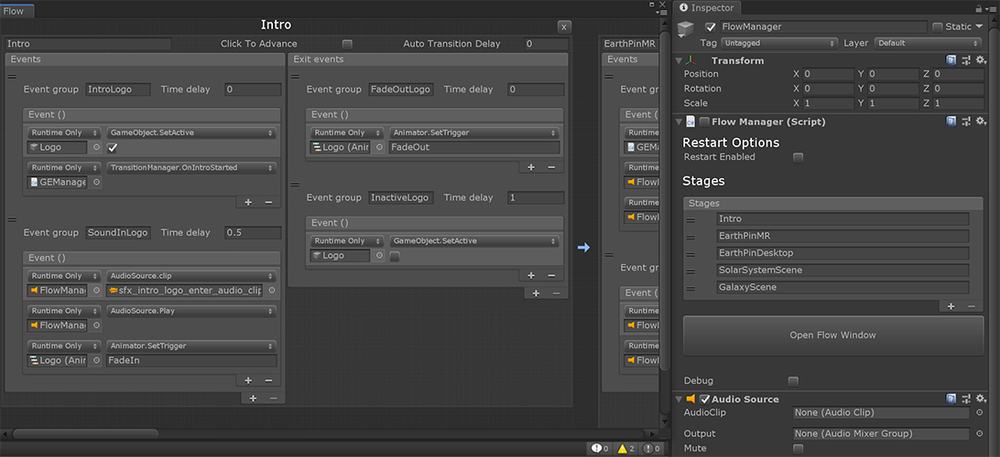
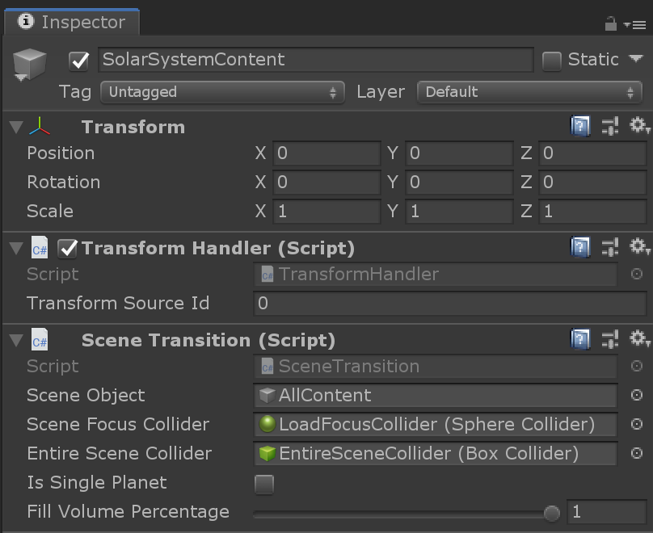
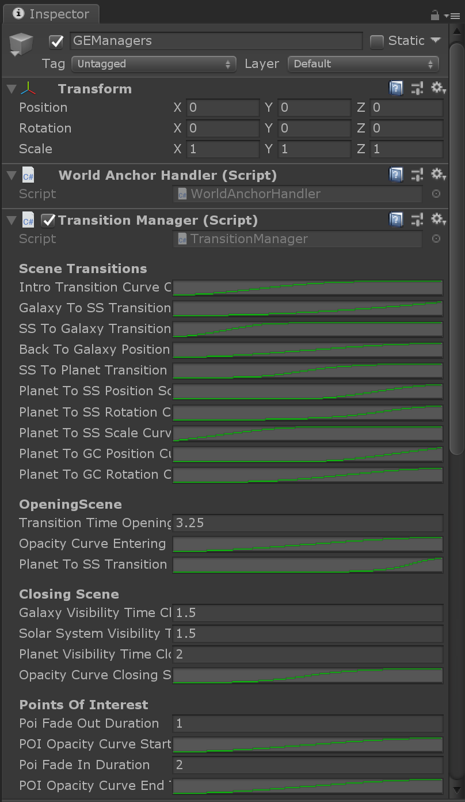

# Application flow

This page contains information how the application is structured, when scenes are triggered and so on.

## CoreSystems scene

`scenes/core_systems_scene.unity` is a scene that contains most of the global game objects. It contains things like the touch manager, the [menu system](MenuSystem.md) and audio functionality. The core_systems_scene is loaded into all content scenes via `Layers` so that developers and artists can run any scene independently from running the main_scene.

## SceneTransition

Each view in the application (galactic disc, galactic center and solar system) is a scene in scenes/view_scenes. Every scene needs to have a Scene Transition component added to the root entity of the scene. All other game objects need to live under this entity. This is used by the [TransitionManager](##TransitionManager) to move from the current scene to another one.

The component is aware of the size of the scene via the reference to a collider named `EntireSceneCollider`. It also contains a `SceneFocusCollider` that defines the focus point within the scene for a transition.

It also has a reference to `SceneObject` - the entity in the scene that the transform is applied to during a transition. This needs to be a child of the SceneTransition (scene root) object and needs to have an identity transform. All game objects of the scene need to be under this scene object or they wont be moved along during transition

## TransitionManager

The actual transition is managed through the [GEManager](##GEManager) in the CoreScene. [ViewLoader](##ViewLoader) handles (un-)loading these scenes and the `TransitionManager` manages the actual movement from one scene to the other through callbacks from the ViewLoader. This system also handles additional animations that are run between scenes for theatrical effect.

### How the transition manager works

First, components not relevant for the transition are disabled, for example the OrbitUpdater, POIRotation animation, PointOfInterests, Touchscript and so on. All these, are components that move the game objects in the scene and should not move during a transition to a new scene.

The new scene will be scaled to fill the given percentage of a global volume. The global volume defined in the transform of TransformSource. The specific percentage for the new scene is set in [SceneTransition](##SceneTransition) component (see above, "*Fill Volume Percentage*").

Next is initialization of zoom in out functionality.
At this step the properties for start and end position, rotation, scale are set and after this
position, rotation and scale of the scene objects should not change from other functionality other
than zoom in out code.

Next all colliders of old and new scene needs to be deactivated so user cant interact with them during transition.

Next, the pois of previous scene fades out, and when that is done, the whole previous scene starts fading out.
The audio transition plays.
The new scene's pois alpha is set to zero so there arent visible
The new scene fades in except its pois
Then, the zoom in out transition starts.
When that is over, the previous scene unloads, 
the new scene's pois fade in and its colliders are being active again.

The transition code is in ZoomInOut.cs

Scenes have focus colliders. For example, solar system scene has as focus collider the sun planet collider.
A single planet scene, will have that collider as focus collider.
The idea is, that the previous and new scene's focus colliders are being transitioned from one into the other.

For example, going from solar system into earth view. The new scene, earth view, will initially be scaled, positioned and rotated
in a way so its focus collider will match exactly the transform of the earth focus collider in solar system view.
The transition code will update both scenes in that way so both focus colliders have matching transforms at any point until
the end of the transition. At the end of the transition, the new scene will have the transform values that it had when it was spawned.
So, the old and new scenes, are being modified, to transition from the previous scene's focus collider transform into the 
next scene's focus collider transform.

ZoomInOut.cs implements the above transition.
Need to take into account any rotation between top parent scene entity and focus collider and any translation.
Need to rotate the scenes around the focus objects as pivots.
Need to scale the scenes around the focus objects as pivots.
So, it takes these into consideration during rotation and scale.

## ViewLoader

`scripts/ViewLoader.cs` lives inside CoreSystems scene and manages the loading & unloading of scenes used throughout the app. TransitionManager calls Viewloader in order to load and unload scenes.
All the rest of the script just hook up on ViewLoader's callbacks in order
to know when a new scene is about to be loaded and when that has been completed.

ViewLoader keeps the trail of scenes in a stack in order to know in which scene to go back.
Scenes during Introduction flow should not go in this stack as user never goes back to introduction flow.

## GEManager

Its the main component of the app.
It decides in which platform the app is running.
It holds references in many other managers of the scene in order for other components
to access them through GalaxyExplorerManager
It also holds properties that are different per platform that other components in the
app use.

# TransformSource

Every scene that is spawned need to be at the same place as the previous one.
In order to keep consecutive scenes in same position, rotation, scale, 
we use TransformSource and TransformHanlde.
There is only one TransformSource in CoreSystems with an ID.
Every scene needs to have a TransformHandle with the matching id of TransformSource.
TransformSource position, rotation and scale are synched with the transform in TransformHandle.
In this way, all scenes, have the same transform values.
