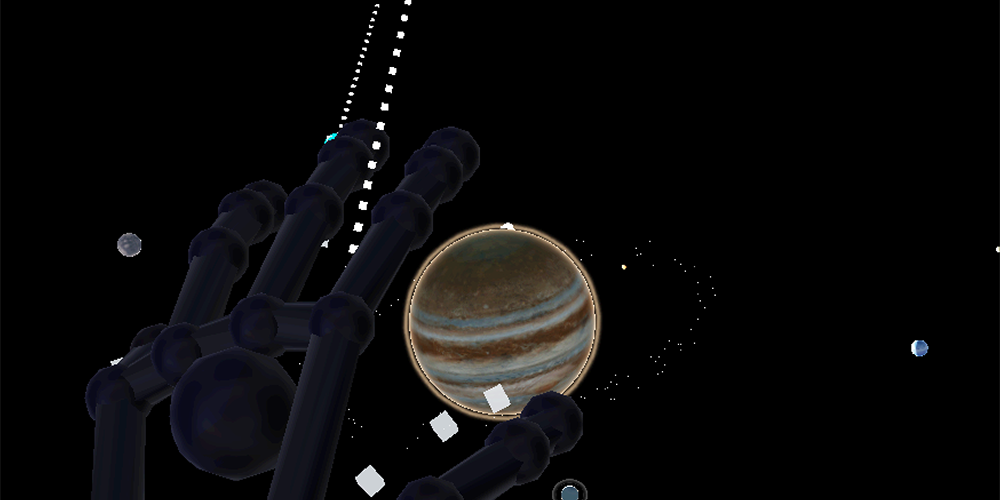
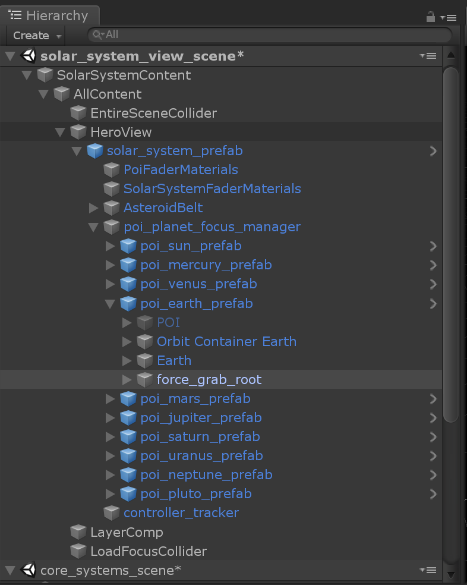
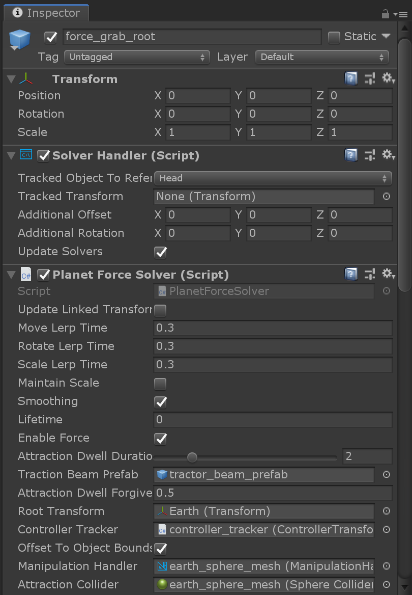
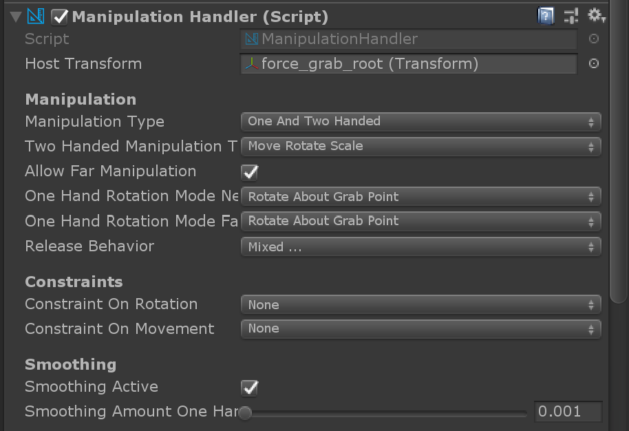
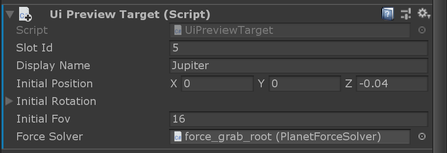

# Force grab interaction

"Force grab" combines a far ray with a progress bar that will pull the targeted object to the user after a specified amount of time. It's a convenient way to pull objects closer without having to learn pinch or air tap gestures. You can read about the concept and prototyping of the force grab [on Microsoft Docs](https://docs.microsoft.com/windows/mixed-reality/galaxy-explorer-update).

## Pulling objects towards the user

The force grab is based on [Solvers in MRTK](https://microsoft.github.io/MixedRealityToolkit-Unity/Documentation/README_Solver.html) as the object should be pulled towards the users hand and follow it as they move around. Solvers can be attached to a controller and an object to make the object tag-along the controller.

Each planet has a `force_grab_root` that contains the `Solver Handler`. On top of that lives the `Planet Force Solver`, which takes care of the scaling, playing and stopping audio as well as showing and hiding the moons (see below).

The `Root Transform` needs to be from the object that should be affected by the pull.

`Attraction Dwell Duration` is the time in seconds from the far ray touching the object until the object is being pulled towards the user. Since the planets are moving and can be hard to target, there is a grace period (`Attraction Dwell Forgiveness`) where the user can "miss" the targeted object and the attraction counter still continues.

The `Traction Beam Prefab` contains the "lasso" effect that reaches out from the controller to the targeted object. 

## Grabbing objects

Grabbing objects is based on the standard one and two handed manipulation in MRTK v2.

## Force grab behavior on desktop

On desktop, selecting planets and solar objects works differently. Instead of selecting planets in their solar system orbits, the users can select them from an overview menu.

Each object in the solar system has an assigned UI Preview Target that will add it to the overview menu.

## Moons

Note that some planets have moons, for example Earth, Mars and Jupiter. The moons are not visible when the planets are orbiting the sun. The `Planet Force Solver` script shows them when a planet is in focus mode and hides them again when the planet loses the focus.
