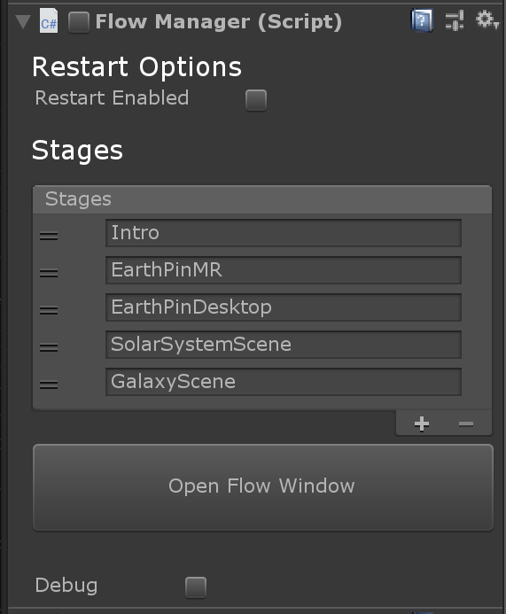

# Intro system

## IntroFlow
The introduction sequence and its transitions at the start of Galaxy Explorer is implemented through the IntroFlow component that can be found attached to the IntroFlow gameobject in the main_scene.

The IntroFlow component in turn is dependent on the FlowManager component.

## FlowManager
FlowManager is a sequencing tool intended to easily drive a simple sequence of interactive (or non-interactive) events. It can be used via its single C# script, or in prefab form. It is dependent on the MRTK for input events.

The FlowManager component can be found attached to the flow_manager_prefab gameobject, child of the Managers gameobject in the core_systems_scene.

## Stages

FlowManager manages transitions between different application stages. In the component's inpsector window you can see the 5 stages that are currently part of Galaxy Explorer's introduction: `Intro`, `EarthPinMR`, `EarthPinDesktop`, `SolarSystemScene` and `GalaxyScene`.

# Editing the flow

FlowManager has a custom in-editor UI which allows you to edit the introduction flow. In the Unity inpector window of the flow_manager_prefab gameobject, click the `Open Flow Window` button on the FlowManager component to open up FlowManager's custom in-editor window.

Here you can see the stages and their transitions in more details. At the end of the flow, after the GalaxyScene stage has been reached, control over transitions is taken over by other parts of the code which handle the more complex transition logic of the rest of the application.

To edit the intro stages, scroll to the utmost right side of the list of stages and press the `[+ new stage]` button. If you want the remove a stage, simply press the `[x]` in the top right corner of the stage you want to remove.

For each stage you can add `Event groups`. These event groups contain both `Events` and `Exit events` that can be hooked up to the appropriate functionality following the regular work flow of Unity events.

# Debug
To get more information on the component directly in the inspector, toggle the Debug toggle at the bottom of the component in the Unity inspector.