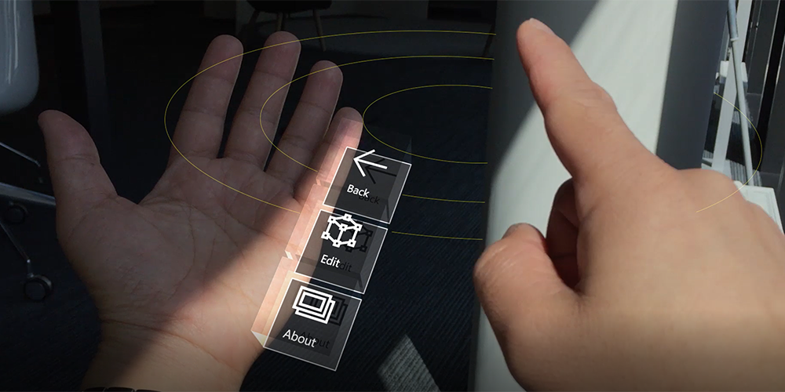

# Menu system

## Global Menu Manager

This script contains the shared functionality between the menus for the different platforms.
It's attached to the menu_managers gameObject in the scene.
It manages the overall menu state and activates/disables the menus according to the correct platform.
It also checks if the reset and back button need to be set to visible.

Buttons are moved dynamically as contextual buttons appear and disappear, but since each of the menus currently has differing logic to decide how, this is for now implemented in the managers belonging to the specific menu types.

## Desktop Menu

[ADD SCREENSHOT]

The menu used for desktop.
Functionality specific to desktop is managed by the DesktopManager (attached to menu_managers gameObject in the scene).

Desktop currently still uses simple native Unity button components and a canvas (the gameObject containing the canvas needs to contain an additional CanvasUtility script to be able to use the MRTKv2 input system).

## GGV Menu

[ADD SCREENSHOT]

The menu floating in front of the user on HoloLens Gen 1 and Windows Mixed Reality occluded headsets.
Functionality specific to these platforms is managed by the GGVMenuManager (attached to menu_managers gameObject in the scene). This menu has two extra buttons on the right to raise and lower the floating menu.

Uses the MRTKv2 PressableButton prefab for its buttons.

## Hand Menu

[ADD SCREENSHOT]

The menu used for platforms that support articulated hands (like HoloLens 2).

Functionality specific to these platforms is managed by HandMenuManager (attached to menu_managers gameObject in the scene).

The hand menus themselves are exist outside the main hierarchy in the scene, since they need to follow the users hands (it is the only menu that moves around according to input). They are implemented through prefabs. Each hand (left and right) has its own prefab.

Apart from the HandMenuManager script, the hand menu is implemented through an additional layer (the HandMenu script), since for this menu there is an additional condition for it to show: Not only the state of the app itself decides if a menu should be visible, the user needs to additionally be facing the palm of his hand. In the HandMenu script, the orientation of the palm joint is used to calculate the angle between the user's palm and the camera forward angle (the user's head).

The hand menu uses solvers from the new toolkit to resolve if any hands are currently tracked and what there position is. (More info about solvers: https://github.com/Microsoft/MixedRealityToolkit-Unity/blob/mrtk_development/Documentation/README_Solver.md)

Uses the MRTKv2 PressableButton prefab for its buttons.

## How To Add New Buttons

How to add new buttons depends on whether they are meant to be contextual or global (always present).

### Global Buttons

### Contextual Buttons