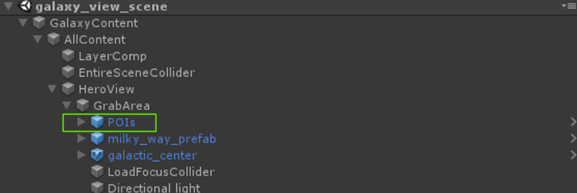
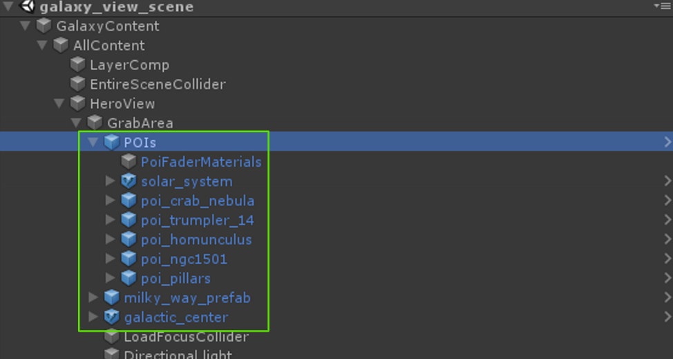
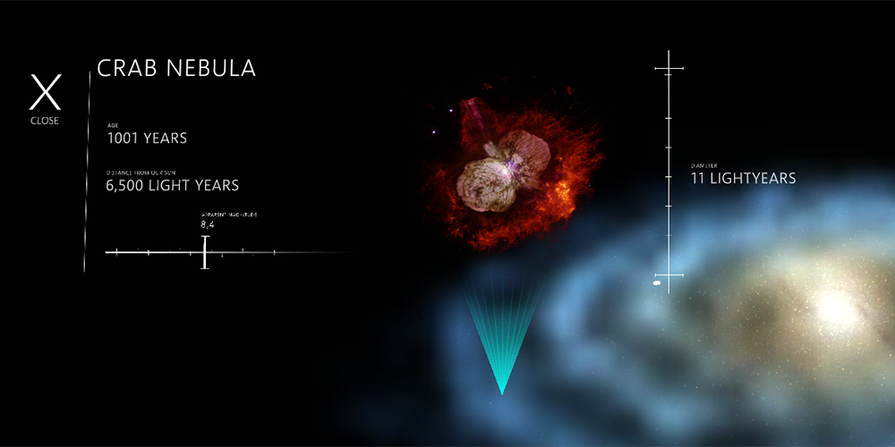
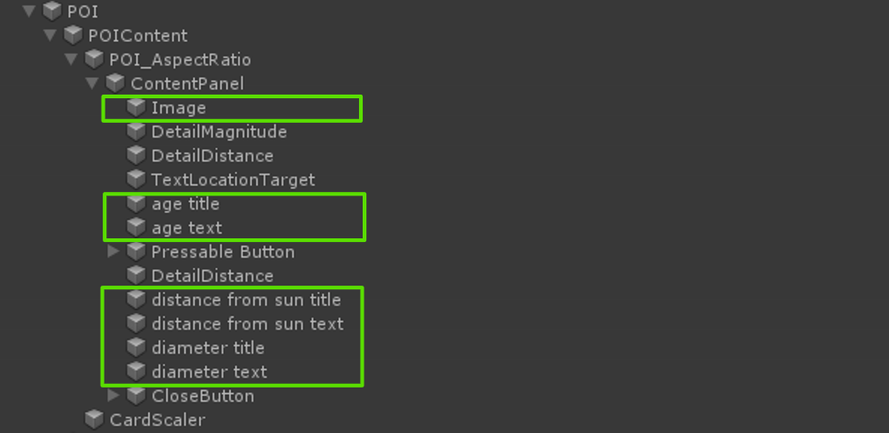
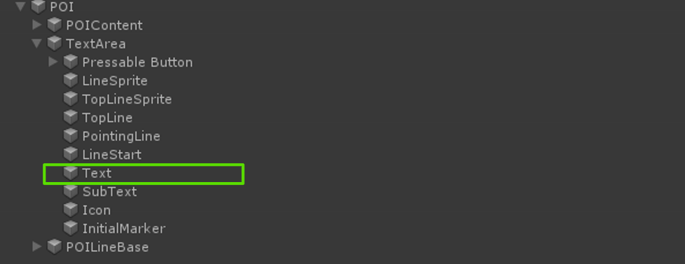
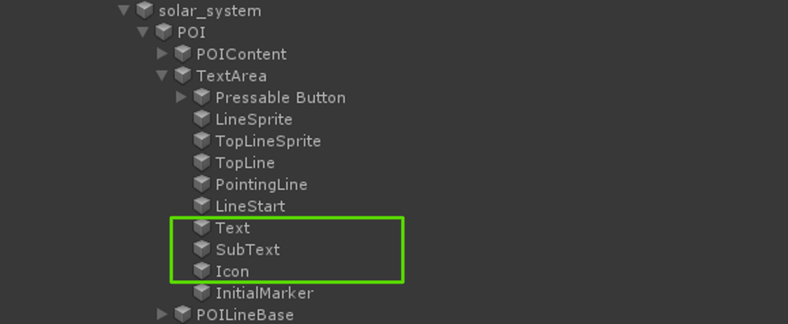

# Points of interest

Points of interest (POI) enable the user to navigate to deeper levels of information within the application.

## Types of POIs

There are 2 types of POI prefabs. Both types share the same content and hierarchy, but differ in what specific components are en-/disabled according to their required functionality in the scene.

- *poi_prefab*: The base prefab, used for a poi that opens up a content window inside the galaxy view on selection.

- *poi_prefab_large*: A variant on poi_prefab, used for a poi that transitions to another scene.

## POI prefab components

Every POI consists of 3 subparts:

- `POIContent`, containing the content for the POI pop-up windows (only relevant for the prefab_poi, not for the large variant).

- `TextArea`, containing the poi text and the interactive functionality (see PressableButton), as well as the poi intermittent highlight. The Pressable Button prefab (MRTK v2) already handles cross-platform input (like WMR controllers, articulated hands, HoloLens Gen 1 gaze-gesture-voice interactions).

- `POILineBase`, the location on the galactic mesh and the line connecting the POI

**Note**: At the time of development the mouse pointer implementation in MRTK v2 was not working as intended. As a result the POIs use a component called `MouseInputEventRouter` as a temporary workaround.  These issues should be fixed as part of Release Candidate 2 (RC2) of the MRTK v2.

## Scripts

- `POIBehavior`: POIBehavior contains the raycasting and fading behavior of the POIs.

- `Card POI`: Script to add the content for the poi_prefab pop-up window.

- `Planet POI`: Script to add the scene to which to transition to.

- `PointOfInterest`: Base class that handles selection and sounds for POI selection. It also controls POI movements in the galaxy and data about the location on the galactic mesh.

## How to add new POIs to the galaxy view

The basic scene to work on POI's is the galaxy_view_scene, which can be found under Assets > scenes > view_scenes.

To create a new point of interest, simply add an instance of the relevant prefab (poi_prefab or poi_prefab_large) to the point of interest hierarchy in the galaxy_view_scene. Where exactly in the hierarchy depends on whether you want the POI to rotate with the galaxy or not (For example, the Galactic Center POI lives outside of the POIs hierarchy since it needs to stay stationary in the scene).

Subsequently, you can then edit the text, visuals and functionality to fit your new point of interest.
After you appropriately named your prefab instance and added it to the scene, the following things need to be changed on the prefabs:

### Adding content POIs

The standard poi_prefab is used for a POI that opens up a content window inside the galaxy view on selection.

	

On POI > POI_Content > POI_AspectRatio > ContentPanel, change the appropriate values on the children named: Image, age title, age text, distance from sun title, distance from sun text, diameter title, diameter text.

	
	
On the child called Text (POI > TextArea > Text), change the text that will appear on the POI in the galaxy view.
	
	
	
Add a voice over audio clip for your point of interest on CardPOI script's CardAudio member variable (attached to the POI child).

	

### Adding link POIs

On the child called Text, change the text in the TextMeshPro component that will appear on the POI in the galaxy view. Additionally the values on SubText and Icon need to be changed for the large point of interest.
	
	

For the large points of interest, you will need to create a new scene to transition to and link the scene in the PlanetPOI script attached to POI in the poi_prefab_large hierarchy.

	
