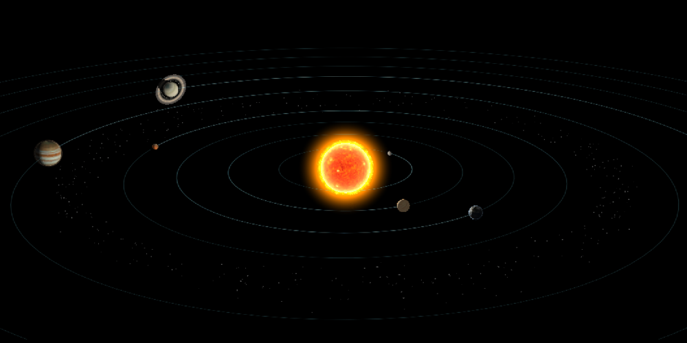
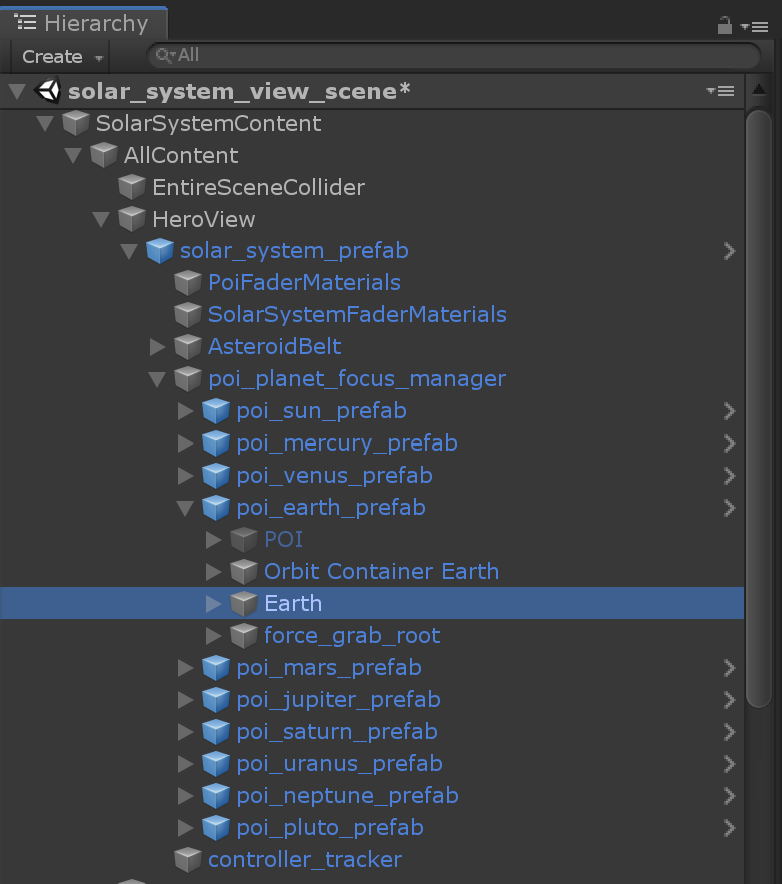
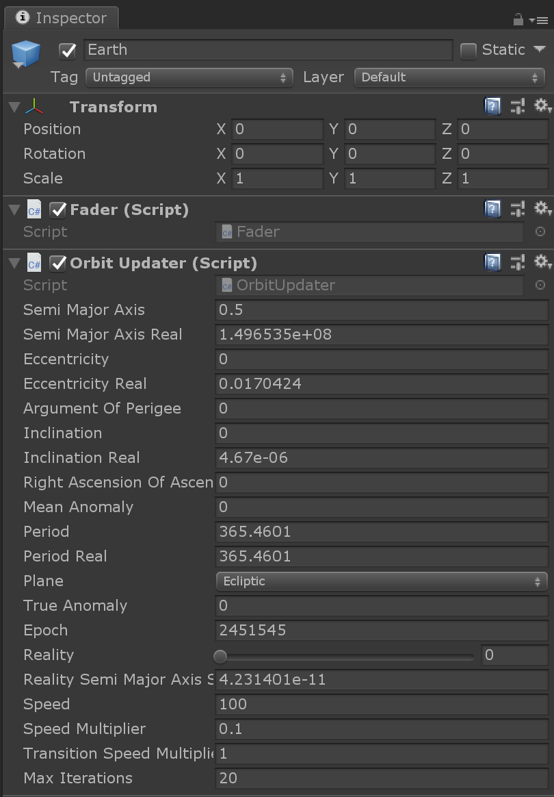
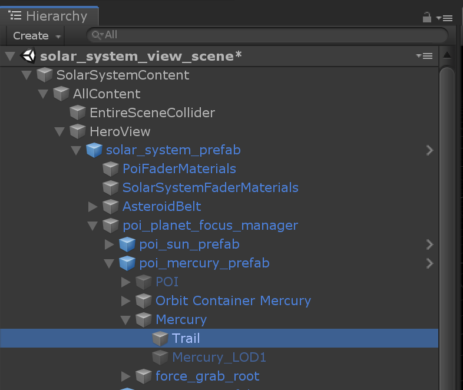
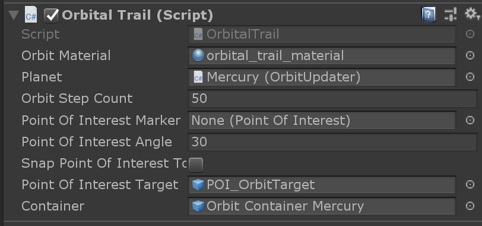
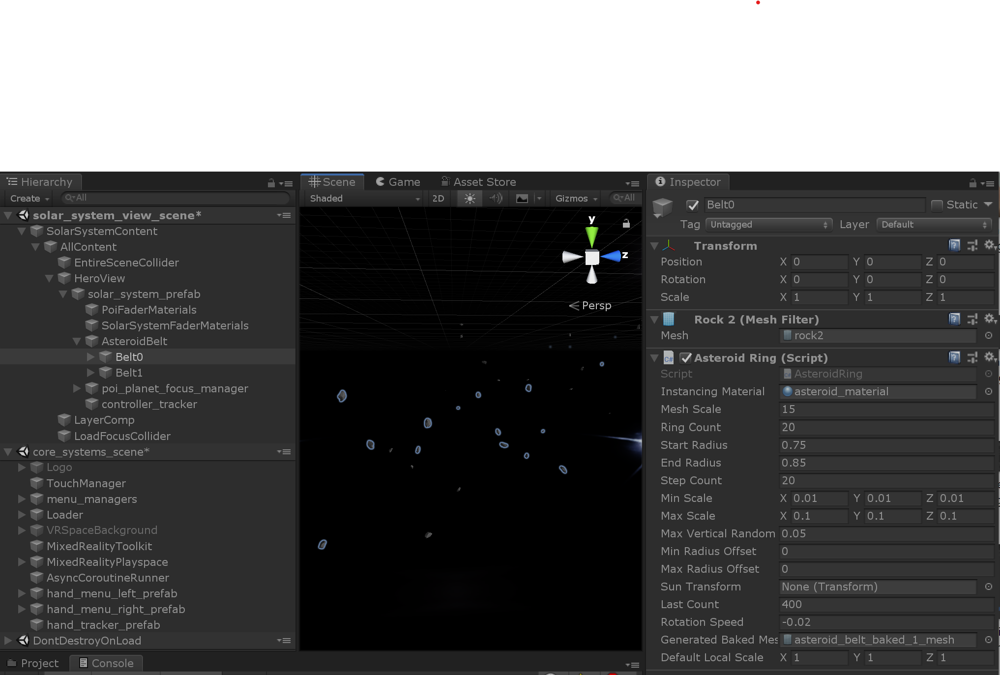

# Solar system

## Realistic mode vs. schematic mode

TBD?

## Planets

Each planet is based on a planet POI in the hierarchy of the solar system. Note that although not actually a planet, the sun is also a planet POI object.

Each planet has specific properties like their distance from the sun and the speed around it, their size, their axial tilt and so on. All those properties can be set for each individual planet in the scene.

## Orbital trails

The orbital trails are screen space lines, expanded by a geometry shader, which are attached to the planets.

Each vertex has 2 positions: one for the real scale view and one for the schematic view. The vertex shader then interpolates between those 2 positions to compute
the final position according the a "reality scale" that moves between 0 and 1 and then passes the final position to a geometry shader that generates correctly triangulated lines in screen space.

This makes the orbits have a fixed width on screen no matter what scale the solar system is being viewed at.

## Asteroid belt

ge_unity_asteroid_belt
Belt 0 rotating faster

## Earth - PlanetShaderEarth

Like all the planets, most parameters are evaluated in the vertex shader as we
have a high poly version of each planet. The light is computed with a N. L
contribution that we gamma correct in order to have a realistic looking light
transition from the dark side to the light side. We also have in the alpha
channel of the Albedo texture a map of the night lights from NASA photographs
that we use to illuminate the dark side of the planet. You might notice that
there are lights in the middle of Australia … which are actually wildfires
that can be seen from space.

## Saturn - PlanetShaderSaturn

In the experience we don't have dynamic shadows enabled - as they are mostly
irrelevant for our scene - except for Saturn. The rings shadow pattern always
plays a big part of the aesthetic look of the planet, so we spent some time
making analytic shadows for it. The logic behind is to project a sphere on a
plane perpendicular to the direction to the light (the sun is approximated as
a directional light) and checking if the resulting pixel is inside of the
shadow or not. For the shadow of the planet on the rings, the world space
position of the pixel on the ring is compared to the radius of the planet
when projected on the plane that contains the pixel. For the shadow of the
rings of the planet, we project the world space position of the pixel on the
planet into the rings plane, and we compare its distance to the center of the
planet to the distance to the inner ring radius and outer ring radius. The
result gives a value in [0-1] which is used to sample a shadow texture.