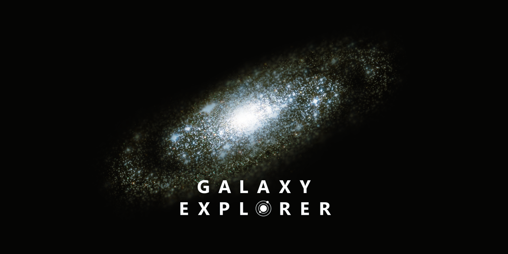

# Building & running the application

## Running in Unity

Note that by default when you download / clone this repository and open it in Unity, it will open a new scene. Navigate to /Scenes and double-click MainScene to setup the editor properly. After that, hitting Play will start the experience.

## Building Galaxy Explorer

From Unity, choose File -> Build Settings to bring up the Build Settings window. All of the scenes in the scenes to Build section should be checked. Choose Universal Windows Platform as the Platform. On the right side, choose
"any device" as the Target device, XAML as the UWP Build Type, 10.0.16299.0
as the SDK, check "Unity C# Projects" and then click Build. Select the folder
called 'UWP' and choose this folder.

After the build completes successfully, an explorer window will pop up.
Navigate into the UWP folder and double-click `Galaxy Explorer.sln` to launch
Visual Studio. From Visual Studio, set the Configuration to **Release**
for faster builds (doesn't use . NET Native) or **Master** to build the
type of package the Store needs (uses . NET Native).

### Building for HoloLens (1st gen)

Make sure to change ARM or x64 to **x86**.
Now you can deploy to the Emulator, a Remote Device, or create a Store
package to deploy at a later time.

### Building for HoloLens 2

Make sure to change ARM or x64 to **x86**.
Now you can deploy to the Emulator, a Remote Device, or create a Store
package to deploy at a later time.

### Building for Windows Mixed Reality headsets

Make sure to change x64 or x86 to **ARM**.
Now you can deploy to the Emulator, a Remote Device, or create a Store
package to deploy at a later time.

### Building for Windows Desktop

Make sure to change ARM to **x64** or **x86**.
Now you can deploy to the Emulator, a Remote Device, or create a Store
package to deploy at a later time.